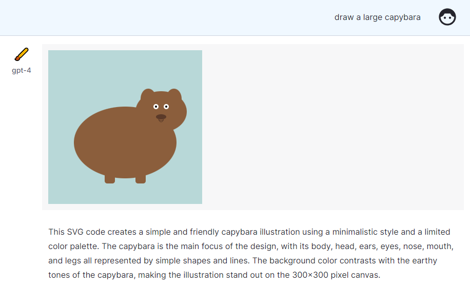
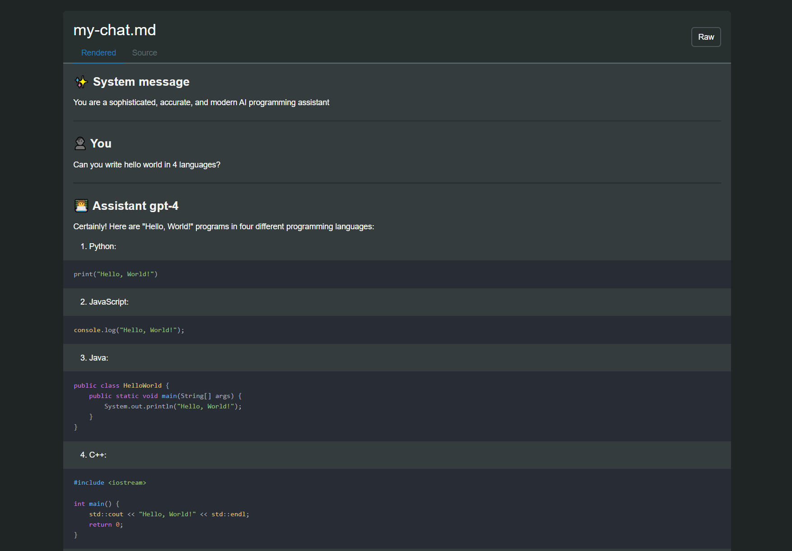
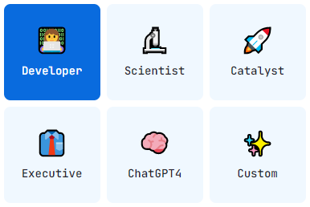
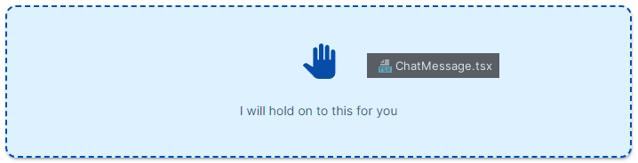

# Next.js ChatGPT 🤖💬

Welcome to `nextjs-chatgpt-app`! 🎉🚀 Responsive chat application powered by OpenAI's GPT-4, with chat streaming, code
highlighting, code execution, development presets, and more. The app is built using Next.js and TypeScript, and it's
designed to be easy to use, customize, and extend. We encourage you to contribute and help improve this project! 😊

[](https://openai-chatgpt-nextjs-full-version.vercel.app/)

## Features ✨
- [x] _NEW 04.14_ 🎉 **SVG Drawing** 🖌️
  <p><a href="docs/feature_svg_drawing.png"></a></p> 
- [x] _NEW 04.13_ 🎉 Token usage progress bars, CTRL+M to use the mic, edge runtime fixes for Cloudflare, [awesome-agi.md](https://github.com/enricoros/awesome-agi)
- [x] _NEW 04.11_ 🎉 **AI-titling** 🧠✍️
- [x] _NEW 04.10_ 🎉 **Multiple chats** 📝📝📝
- [x] _NEW 04.09_ 🎉 **Microphone improvements** 🎙️
- [x] _NEW 04.08_ 🎉 **Precise Token counter** 📊 extra-useful
- [x] _NEW 04.08_ 🎉 Organization ID for OpenAI users
- [x] _NEW 04.07_ 🎉 **Pixel-perfect Markdown** 🎨
- [x] _NEW 04.04_ 🎉 **Download JSON** to export/backup chats 📥
- [x] _NEW 04.03_ 🎉 **PDF import** 📄🔀🧠 (fredliubojin) <- "ask questions to a PDF!" 🤯
- [x] _NEW 04.03_ 🎉 **Tokens utilization** 📊 [Initial - just new messages, not full chat]
  <p><a href="docs/feature_token_counter.png"></a></p> 
- [x] _NEW 04.02_ 🎉 **Markdown rendering** 🎨 (nilshulth) [WIP]
- [x] 🎉 **NEW 04.01** Typing Avatars
  <p><a href="docs/record.gif"></a></p>
- [x] 🎉 **NEW 03.31** Publish & share chats to paste.gg 📥
  <p><a href="docs/screenshot_export_example1.png"></a></p>
- [x] Chat with GPT-4 and 3.5 Turbo 🧠💨
- [x] **Private**: user-owned API keys 🔑 and localStorage 🛡️
- [x] **System presets** - including Code, Science, Corporate, and Chat 🎭
  <p><a href="docs/screenshot_purpose_two.png"></a></p>
- [x] **Syntax highlighting** - for multiple languages 🌈
- [x] **Context** - Drag and drop files to add them to the prompt 📁
  <p><a href="docs/screenshot_drop_target.png"></a></p>
- [x] **Stop generation** 🛑 (fredliubojin)
- [x] **Voice input** 🎙️ (koganei)
- [x] Real-time streaming of AI responses ⚡
- [x] Switch API hosts to track quality, including [Helicone](https://www.helicone.ai/) 📈
- [x] Dark mode 🌙 - Wide mode ⛶
- [ ] Add your own feature 🚀
- [ ] Send a PR 🙌

## Developing 🚀

Tech Stack 🛠️


Simply clone the repository, install the dependencies, and run the development server:

```
git clone https://github.com/hightecular95908/openai-chatgpt-nextjs-full-version.git
cd openai-chatgpt-nextjs-full-version
npm i
npm run dev
```

Now the app should be running on `http://localhost:3000`.

powered by hightecular95908
